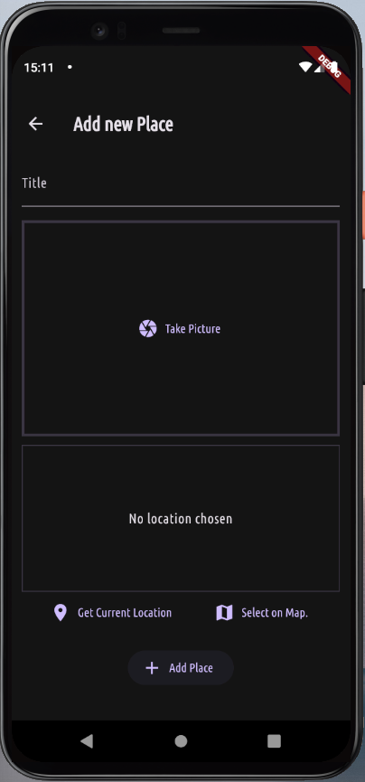

# Favorite Places

A Flutter application that allows users to save their favorite places using native device features, such as camera and location.

## 🖼️ Screenshots

|  |  |  |
|----------------------|----------------------|----------------------|
|  |  |  |

## 📋 Description

**Favorite Places** is an app that enables users to:
- **Save places**: Take a photo and register the location using the Google Maps API.
- **View details**: Check a list of saved places with detailed images and addresses.
- **Explore on the map**: Click on the map to see the location displayed larger on Google Maps.


## 🛠️ Features

1. **Place registration**:
   - Take a photo directly through the app.
   - Capture the current location or select one on the map.

2. **Places list**:
   - Displays a list of saved places.
   - Click on an item to view details, including the image, address, and map.

3. **Map visualization**:
   - Expand the location on Google Maps directly from the app.

4. **Local storage**:
   - All data is saved in a SQLite database for offline access.


## 📱 Technologies Used

- **Flutter**: Framework for cross-platform development.
- **SQLite**: Local database for data storage.
- **Google Maps API**: Integration for location capture and visualization.
- **Path Provider**: To manage file paths on the device.


## 🚀 How to Run the Project

1. **Clone the repository**:
   ```bash
   git clone https://github.com/jamison0902/flutter-favorite-place.git

2. **Install dependencies**:
   ```bash
   flutter pub get

3. **Set up the Google Maps API Key**:
    - Replace your key in the android/app/src/main/AndroidManifest.xml file and configure the iOS file if necessary.

4. **Run the project**:
    ```bash
   flutter run


